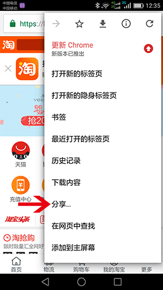

# bookmark-rn
React Native project for [bookmark-app](https://github.com/futurist/bookmark-app), can be installed on Android/iOS as standalone app to receive bookmarks from browsers/other apps.

**Snapshot**

## Notes
The [server side](https://github.com/futurist/bookmark-server) is using [rem service](https://github.com/lhorie/rem), which using your cookies as datastore, that good for quick setup/test your porjects, but cannot share data between different clients, so you may lost your data by switch to other clients/browsers.

